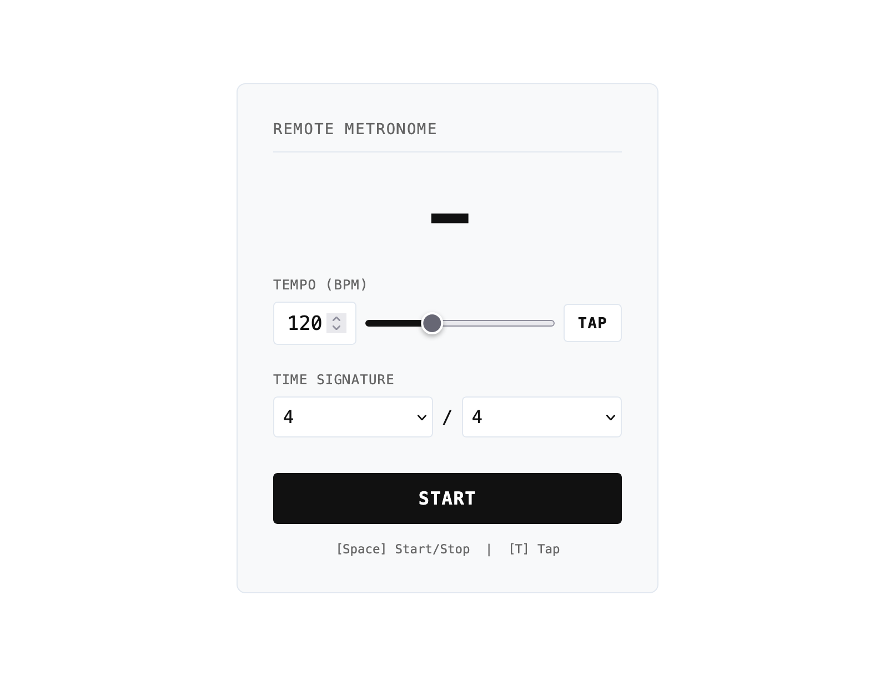
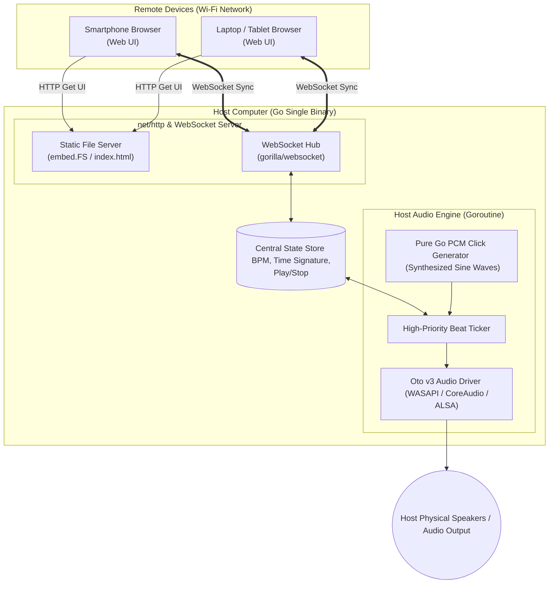

# Remote Metronome



A lightweight, portable, cross-platform metronome that plays sample-accurate audio directly through your host computer's speakers while allowing real-time remote control from any smartphone, tablet, or web browser on your local network.


---

## Features

- **Host-Side Audio Output:** Synthesized metronome clicks play natively through the host machine's physical speakers to avoid browser audio jitter and timing drift.
- **Real-Time WebSocket Sync:** Control tempo, time signatures, and playback across multiple connected devices simultaneously.
- **Minimalist Web UI:** Clean, monospaced interface that automatically adapts to your system's light or dark mode preferences.
- **Flexible Tempo Controls:** Set BPM via slider, direct numeric input, or the built-in **Tap Tempo** engine.
- **Time Signature Support:** Full support for standard and odd meters (1/4, 2/4, 3/4, 4/4, 5/4, 6/4, 7/4).
- **Keyboard Shortcuts:** Control playback quickly with `Space` (Start/Stop) and `T` (Tap Tempo).
- **Terminal QR Code:** Displays a scannable QR code on startup for immediate mobile connection.
- **Single Zero-Dependency Binary:** Self-contained executable built in Go with embedded static web assets.

---

## Architecture



1. The Go application runs on your host machine, serving an embedded single-page web UI while managing a high-priority background audio thread.
2. Web controllers send state updates (`BPM`, `Time Signature`, `Play/Stop`) over a persistent WebSocket connection.
3. State changes are instantly broadcast to all connected devices to keep UI beat indicators in sync.

---

## Quick Start

### 1. Download Executable
Download the compiled binary for your platform (Windows, macOS, Linux) from the [Releases](https://github.com/matejkubinec/remote-metronome/releases) page.

### 2. Launch the Application
Run the executable from your terminal:

```bash
# macOS / Linux
./remote-metronome

# Windows
.\remote-metronome.exe
```

### 3. Connect Devices

* **Local Control:** Open `http://localhost:8080` on the host machine.
* **Remote Control:** Ensure your smartphone is connected to the same Wi-Fi network and scan the QR code printed in the terminal, or navigate to `http://<HOST-IP>:8080`.

---

## Keyboard Shortcuts

| Key | Action |
| --- | --- |
| `Space` | Toggle Start / Stop |
| `T` | Tap Tempo |
| `Enter` | Unfocus numeric BPM input field |

---

## Building from Source

### Prerequisites

* [Go 7+](https://golang.org/doc/install)
* **Linux only:** ALSA library headers (`sudo apt-get install libasound2-dev`)

### Build Steps

1. **Clone the repository:**
```bash
git clone https://github.com/matejkubinec/remote-metronome.git
cd remote-metronome
```


2. **Initialize and download dependencies:**
```bash
go mod download

```


3. **Build the binary:**
```bash
go build -ldflags="-s -w" -o remote-metronome .
```


4. **Run:**
```bash
./remote-metronome
```

---

## License

[MIT License](./LICENSE) © [Matej Kubinec](https://github.com/matejkubinec)

